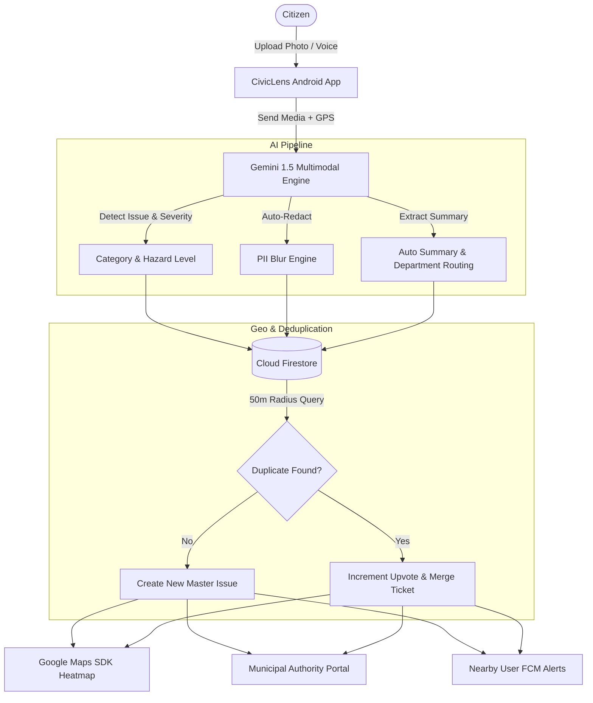
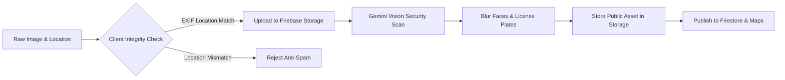
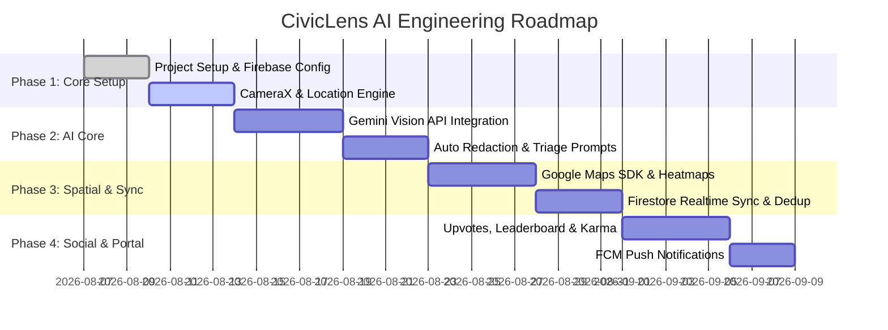

# 🏛️ CivicLens AI: Smart Civic Issue Reporting & Resolution Platform
## Comprehensive Project Specification & Architectural Report

**Document Details**
- **Project Name:** CivicLens AI
- **Document Version:** 1.0.0
- **Date:** August 6, 2026
- **Target Platform:** Android (Native Java/Kotlin)
- **Repository:** [CivicLens-AI Repository](https://github.com/ITSTANVI28/CivicLens-AI.git)

---

## 📋 Executive Summary

Urban civic maintenance—such as fixing potholes, repairing damaged streetlights, clearing overflowing garbage bins, and sealing water leaks—suffers from severe operational bottlenecks due to manual complaint logging, lack of verification, and fragmented communication between citizens and municipal authorities. 

**CivicLens AI** bridges this gap by introducing a mobile-first, AI-driven civic engagement platform. By pairing single-tap photo capture with Google's **Gemini Multimodal AI**, CivicLens AI automatically identifies issue categories, estimates hazard severity, redacts personally identifiable information (PII), detects duplicate reports within geographical radii, and maps issues onto a live interactive city map. Nearby citizens can verify issue status, while municipal authorities gain a centralized SLA-backed dispatch dashboard for rapid resolution.

---

## 🎯 Problem Statement & Strategic Objective

### Current Industry Challenges
1. **High Friction in Reporting**: Traditional civic portals require citizens to manually fill out long forms, select obscure administrative categories, and guess exact ward numbers.
2. **Duplicate Report Flooding**: Major road hazards (e.g., a central avenue pothole) trigger hundreds of individual complaints, overwhelming municipal call centers and dispatch teams.
3. **Lack of Transparency & Accountability**: Citizens receive static reference numbers without real-time progress tracking or verification of completed repairs.
4. **Spam & False Reports**: Unverified submissions divert municipal resources away from genuine high-priority emergencies.

### CivicLens AI Strategic Objectives
* **Zero-Form Reporting**: Reduce reporting time to under 10 seconds via AI-assisted image and voice analysis.
* **Automated Triage**: Automatically classify issues, assign severity levels, and route tickets to responsible departments.
* **Deduplication Engine**: Group localized duplicate complaints into a single master ticket with an upvote count.
* **Crowdsourced Verification**: Utilize community verification to confirm both issue persistence and post-repair resolution.

---

## 🚀 Complete Feature Specification



### 1. 📸 AI-Powered Capture & Triage Engine
* **Instant Multimodal Classification**: Automatically categorizes issues into standard urban domains:
  - 🕳️ **Road Infrastructure**: Potholes, open manholes, damaged curbs, broken asphalt.
  - 🧹 **Sanitation & Waste**: Overflowing bins, illegal dumping, uncollected trash.
  - 💧 **Water & Drainage**: Pipe leaks, street flooding, clogged storm drains.
  - 💡 **Electrical & Lighting**: Broken streetlights, hanging wires, exposed junction boxes.
  - 🌳 **Environment & Public Safety**: Fallen trees, damaged park equipment, broken signs.
* **Hazard Severity Assessment**: Gemini AI evaluates safety hazards into 4 distinct tiers:
  - `CRITICAL` (Immediate danger to life/traffic; e.g., open manholes, exposed wires; 24h SLA).
  - `HIGH` (Major obstruction or hazard; e.g., deep potholes on main roads; 72h SLA).
  - `MEDIUM` (Moderate inconvenience; e.g., uncollected garbage, non-functional streetlight; 7-day SLA).
  - `LOW` (Minor aesthetic issues; e.g., faded paint, minor litter; 14-day SLA).
* **AI Automated Privacy Guard (PII Blurring)**: Scans input images for human faces and vehicle license plates, applying Gaussian blur before publishing to the public live map.
* **Multilingual Voice Reporting**: Enables citizens to speak in their local language (e.g., Hindi, Spanish, Marathi, English). Gemini transcribes the speech, translates it, and populates structured report fields.

### 2. 🗺️ Live Spatial Mapping & Deduplication Engine
* **Real-time City Heatmap**: Renders issue density using Google Maps SDK Heatmap Tile Layers, enabling citizens and city planners to visualize problem clusters.
* **Spatial-Visual Deduplication Algorithm**:
  1. Captures precise device GPS (latitude, longitude, geohash).
  2. Executes a spatial query for existing open reports within a **50-meter radius**.
  3. Uses Gemini image similarity comparison between the new photo and existing candidate photos.
  4. If a match is found, the new submission automatically converts into an **Upvote / Confirmation** on the existing ticket instead of creating clutter.
* **Proximity Push Notifications**: Triggers Firebase Cloud Messaging (FCM) alerts to users within a 1km radius when a `CRITICAL` hazard is validated nearby.

### 3. 👥 Community Verification & Gamification
* **Crowdsourced Status Audits**: Citizens can visit mapped locations and tap verification options:
  - `Still Exists` (Increases severity weight)
  - `Work in Progress` (Saves progress photo)
  - `Fully Resolved` (Triggers resolution audit)
* **Proof-of-Fix Double-Check**: When an authority marks a ticket as `RESOLVED`, nearby top-rated users receive a request to upload a confirmation photo to close the ticket officially.
* **Civic Karma & Reputation Leaderboard**:
  - Points awarded for valid reports (+50 pts), verifications (+20 pts), and confirmed fixes (+100 pts).
  - Badges: `Civic Guardian`, `Eco Sentinel`, `Road Safety Champ`, `Master Auditor`.

### 4. 🏢 Municipal Authority Dashboard
* **SLA & Escalation Timers**: Countdown timers for each ticket based on assigned severity tier.
* **Department Triage & Auto-Routing**: Automatically directs tickets to specific department queues (Public Works, Electricity Board, Sanitation, Water Department).
* **Route Optimization for Crews**: Groups open tickets geographically into efficient daily routes for field maintenance teams.

---

## 🛠️ System Architecture & Technology Stack

### Recommended Stack

| Layer | Technology | Role / Purpose |
| :--- | :--- | :--- |
| **Mobile Client** | Native Android (Java / Kotlin) | Material Design 3 UI, CameraX, FusedLocationProviderClient, WorkManager |
| **Authentication** | Firebase Authentication | Phone OTP, Google Sign-In, Anonymous Guest Mode |
| **Database** | Cloud Firestore | NoSQL document database, real-time snapshot listeners, geohash spatial queries |
| **Object Storage** | Firebase Storage | Scalable cloud storage for original and anonymized report images |
| **Maps & Location** | Google Maps SDK for Android | Interactive map, custom marker clustering, heatmap tile provider |
| **Push Alerts** | Firebase Cloud Messaging (FCM) | Topic-based push notifications for nearby issue alerts |
| **AI / ML Engine** | Google Gemini 1.5 Flash Vision API | Image classification, PII redaction detection, hazard scoring, auto-summary |
| **Background Processing** | Android WorkManager | Offline queue for offline report creation and auto-retry on reconnect |

---

## 🗄️ Cloud Firestore Data Schema

### 1. `issues` Collection
```json
{
  "issueId": "iss_89712410",
  "reporterUid": "usr_998124",
  "category": "POTHOLE",
  "severity": "HIGH",
  "title": "Severe Pothole on 5th Avenue",
  "description": "Large asphalt crater causing heavy traffic slowdown and tire damage.",
  "department": "PUBLIC_WORKS",
  "originalImageUrl": "https://firebasestorage.googleapis.com/.../orig.jpg",
  "publicImageUrl": "https://firebasestorage.googleapis.com/.../blurred.jpg",
  "location": {
    "latitude": 12.971598,
    "longitude": 77.594566,
    "geohash": "tdr2be7",
    "address": "124 5th Avenue, Ward 4"
  },
  "status": "ASSIGNED",
  "upvotes": 34,
  "confirmationsCount": 12,
  "isDuplicate": false,
  "parentIssueId": null,
  "createdAt": 1722944800000,
  "updatedAt": 1722951000000,
  "slaDeadline": 1723204000000
}
```

### 2. `verifications` Collection
```json
{
  "verificationId": "ver_554129",
  "issueId": "iss_89712410",
  "userUid": "usr_771209",
  "vote": "STILL_EXISTS",
  "photoUrl": "https://firebasestorage.googleapis.com/.../proof.jpg",
  "comment": "Inspected at 10 AM. Repairs not started yet.",
  "timestamp": 1722952000000
}
```

### 3. `users` Collection
```json
{
  "uid": "usr_998124",
  "displayName": "Sarah Jenkins",
  "email": "sarah@example.com",
  "karmaPoints": 420,
  "badge": "CIVIC_GUARDIAN",
  "totalReports": 14,
  "verifiedFixes": 8,
  "createdAt": 1720000000000
}
```

---

## 🔒 Security, Privacy & Reliability Matrix



1. **Anti-Spam & Anti-Fraud Security**:
   - **GPS Verification**: Compares phone live GPS coordinates against photo EXIF metadata to ensure the user is physically present at the scene.
   - **Submission Rate Limits**: Restricts users to a maximum of 5 issue reports per hour to prevent bot spamming.
2. **Offline-First Resilience**:
   - Uses Android `WorkManager` to cache pending reports in a local SQLite/Room store if network connection is lost.
   - Automatically retries upload and Gemini processing once cellular data or Wi-Fi is restored.
3. **Data Protection**:
   - Standard Firestore Security Rules ensure users can only edit their own draft profile data while public reads are restricted to non-sensitive fields.

---

## 📅 Development Roadmap & Project Phases



---

## 📊 Summary & Recommendation

CivicLens AI represents a modern, AI-native approach to smart city governance. By combining **Gemini Vision AI**, **Android Native Location/Camera Services**, **Firebase Cloud Infrastructure**, and **Google Maps SDK**, the platform turns every citizen into an active contributor to city infrastructure maintenance.

The architecture outlined in this report guarantees high performance, robust privacy compliance, low submission friction, and scalable duplicate handling.
