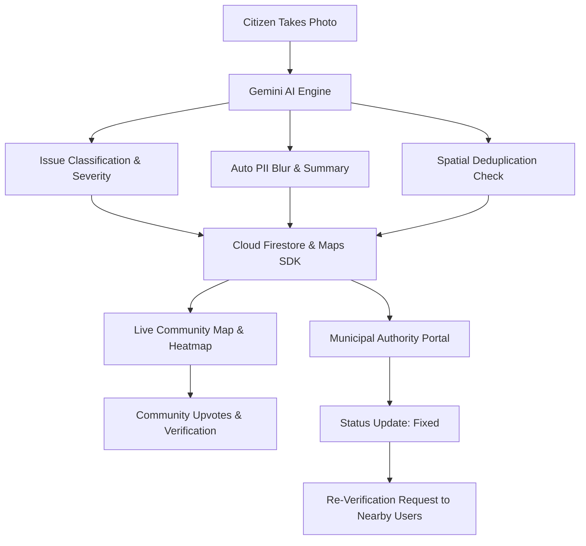
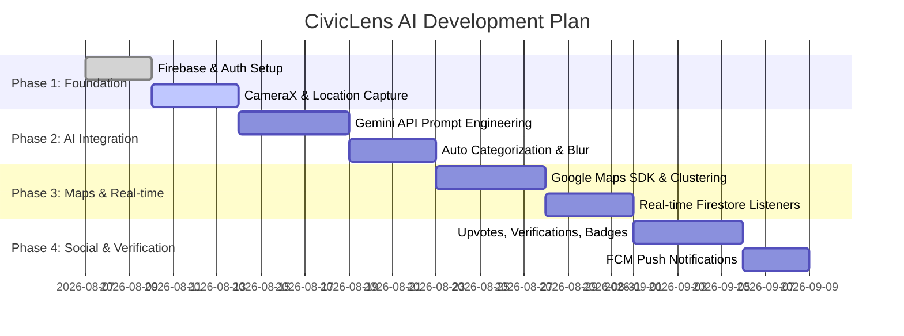

# 🏛️ CivicLens AI - Smart Civic Issue Reporting & Resolution Platform

> **CivicLens AI** is an AI-powered, community-driven civic engagement platform that empowers citizens to report urban issues (potholes, garbage dumps, water leaks, damaged streetlights) using computer vision, real-time spatial mapping, and automated authority dispatching.

---

## 🔍 Executive Summary & Strategic Review

### ✅ Strengths of Your Original Concept
1. **Clear Value Proposition**: Solves the real-world friction of reporting civic problems with instant photo uploads instead of tedious manual forms.
2. **Impactful AI Integration**: Utilizing multimodal AI (Gemini Vision) for automatic issue taxonomy, severity scoring, department tagging, and duplicate identification.
3. **Crowdsourced Verification**: Reduces municipal workload by letting local citizens verify whether an issue is genuine, active, or fixed.
4. **Real-time Map & Heatmap**: Visualizes city infrastructure health dynamically for both citizens and local authorities.

---

## 🛠️ Critical Considerations & Pitfalls to Address

| Area | Challenge / Risk | Recommended Solution |
| :--- | :--- | :--- |
| **Privacy & PII** | Photos may accidentally capture faces, private homes, or vehicle license plates. | **AI Privacy Guard**: Run Gemini/Vision model to blur faces and license plates automatically before public map rendering. |
| **Spam / Fake Reports** | Malicious users uploading internet images or fake locations. | **Geofence & Metadata Validation**: Verify device GPS against photo EXIF metadata and enforce a maximum reporting radius. |
| **Network Connectivity** | Citizens often spot issues in areas with poor cellular connectivity. | **Offline-First Architecture**: Store drafts locally using Android `WorkManager` & Room/Firestore offline persistence, auto-syncing when online. |
| **Duplicate Flooding** | Multiple citizens reporting the same major pothole or pipe burst. | **Spatial-Visual Deduplication**: Query Firestore within a 50m radius and use Gemini image similarity to group reports into a single master ticket. |
| **Authority Handshake** | Reports might sit unresolved without clear accountability. | **SLA Tracking & Lifecycle Pipeline**: Define transparent status stages (`Reported` ➔ `Triaged` ➔ `Assigned` ➔ `In Progress` ➔ `Resolved` ➔ `Community Verified`). |

---

## 🚀 Enhanced Feature Roadmap



### 1. 📷 Smart AI Capture & Processing
* **Automated Issue Classification**: Instant multi-label detection (Pothole, Open Manhole, Overflowing Garbage Bin, Water Leakage, Fallen Tree, Broken Streetlight, Damaged Signage).
* **Severity & Hazard Rating**: Gemini evaluates structural hazard (`Low`, `Medium`, `High`, `Critical / Emergency`).
* **Automated Department Routing**: Maps issue to the responsible department (e.g., *Public Works Department*, *Water Supply Board*, *Electricity Board*, *Sanitation Dept*).
* **AI Summary & Description**: Generates a concise title and one-line summary for authority dispatchers.
* **Multilingual Voice-to-Report**: Citizens can speak in local languages; Gemini transcribes and formats the report.

### 2. 🗺️ Spatial Mapping & Deduplication
* **Live Heatmap Layer**: Visualizes high-density problem zones using Google Maps Heatmap Tile Layer.
* **Radius-Based Deduplication**: When a new issue is submitted, the system checks existing reports within a 50m radius. If similar, it prompts: *"Is this the same issue as Pothole #4092?"* and converts the report into an upvote/confirmation.
* **Proximity Push Notifications**: Nearby registered users (within 1km) receive alerts for newly confirmed critical hazards (e.g., open manhole).

### 3. 👥 Community Verification & Gamification
* **Status Audit Trail**: Users can submit "Verification Updates" (`Still Exists`, `Getting Worse`, `Work Started`, `Fully Fixed`).
* **Proof-of-Fix Verification**: When authorities mark an issue as "Resolved", nearby users receive a request to upload a confirmation photo.
* **Impact Badges & Leaderboard**: Earn civic karma points (`Civic Guardian`, `Eco Sentinel`, `Road Safety Champ`) for verified reports and updates.
* **Civic Health Score**: Displays a district/neighborhood cleanliness and infrastructure rating based on resolved vs. open tickets.

### 4. 🏢 Authority & Department Dashboard
* **SLA & Escalation Timers**: Assigns target resolution windows based on severity (e.g., Critical: 24h, High: 72h).
* **Route Optimization for Crews**: Groups nearby issues into efficient daily routes for repair workers.
* **Transparent Analytics**: Publicly accessible resolution metrics (% issues resolved within SLA, average resolution time by department).

---

## 🏗️ System Architecture & Tech Stack

```
 ┌─────────────────────────────────────────────────────────┐
 │                   Android Client                        │
 │  • Java / Kotlin (Material Design 3, View Binding)      │
 │  • Google Maps SDK, Fused Location Provider             │
 │  • CameraX / Image Picker + WorkManager                 │
 └────────────────────────────┬────────────────────────────┘
                              │
                    HTTPS API / SDK Calls
                              │
 ┌────────────────────────────▼────────────────────────────┐
 │                   Firebase Backend                      │
 │  • Firebase Authentication (Email/Google/Phone OTP)     │
 │  • Cloud Firestore (Realtime DB & Spatial Queries)      │
 │  • Firebase Cloud Storage (Images & Compressed Assets)  │
 │  • Cloud Functions (FCM Triggers, Deduplication Logic)  │
 └────────────────────────────┬────────────────────────────┘
                              │
 ┌────────────────────────────▼────────────────────────────┐
 │                     AI Engine                           │
 │  • Gemini 1.5 Flash / Pro Vision API                    │
 │  • Multimodal Visual Classification & PII Anonymization  │
 └─────────────────────────────────────────────────────────┘
```

---

## 🗄️ Database Schema (Cloud Firestore)

### Collection: `issues`
```json
{
  "issueId": "iss_98234710",
  "reporterUid": "usr_550e8400",
  "category": "POTHOLE",
  "severity": "HIGH",
  "title": "Deep Pothole near Main Street Intersection",
  "description": "Large road crater causing vehicle slowing and hazard for two-wheelers.",
  "department": "PUBLIC_WORKS",
  "imageUrl": "https://firebasestorage.googleapis.com/...",
  "anonymizedImageUrl": "https://firebasestorage.googleapis.com/...",
  "location": {
    "latitude": 12.9716,
    "longitude": 77.5946,
    "geohash": "tdr2be7",
    "address": "45 Main St, Sector 4"
  },
  "status": "TRIAGED", 
  "confirmationsCount": 14,
  "upvotes": 28,
  "isDuplicate": false,
  "parentIssueId": null,
  "createdAt": 1722944800000,
  "updatedAt": 1722948400000,
  "slaDeadline": 1723204000000
}
```

### Collection: `verifications`
```json
{
  "verificationId": "ver_12345",
  "issueId": "iss_98234710",
  "userUid": "usr_99812",
  "statusVote": "STILL_EXISTS", 
  "comment": "Still present as of this morning.",
  "imageUrl": "https://firebasestorage.googleapis.com/...",
  "timestamp": 1722950000000
}
```

### Collection: `users`
```json
{
  "uid": "usr_550e8400",
  "displayName": "Alex Citizen",
  "email": "alex@example.com",
  "karmaPoints": 340,
  "badgeLevel": "CIVIC_GUARDIAN",
  "reportsSubmitted": 12,
  "verificationsSubmitted": 25,
  "createdAt": 1720000000000
}
```

---

## 📅 Implementation Phases



---

## 💡 Summary of Key Enhancements Added

1. **AI Safety & Privacy Guard**: Automated face and license plate anonymization prior to display.
2. **Spatial & Visual Deduplication**: Prevents spamming authorities with multiple reports for the same issue.
3. **SLA & Department Lifecycle**: Structured progress tracking from report to resolution.
4. **Offline-First Support**: Android `WorkManager` queue for reporting without active internet connection.
5. **Community Re-Verification**: Crowdsourced double-checking after municipal authorities flag an issue as "Fixed".
6. **Detailed Firestore Data Schemas**: Complete JSON structures ready for app implementation.
